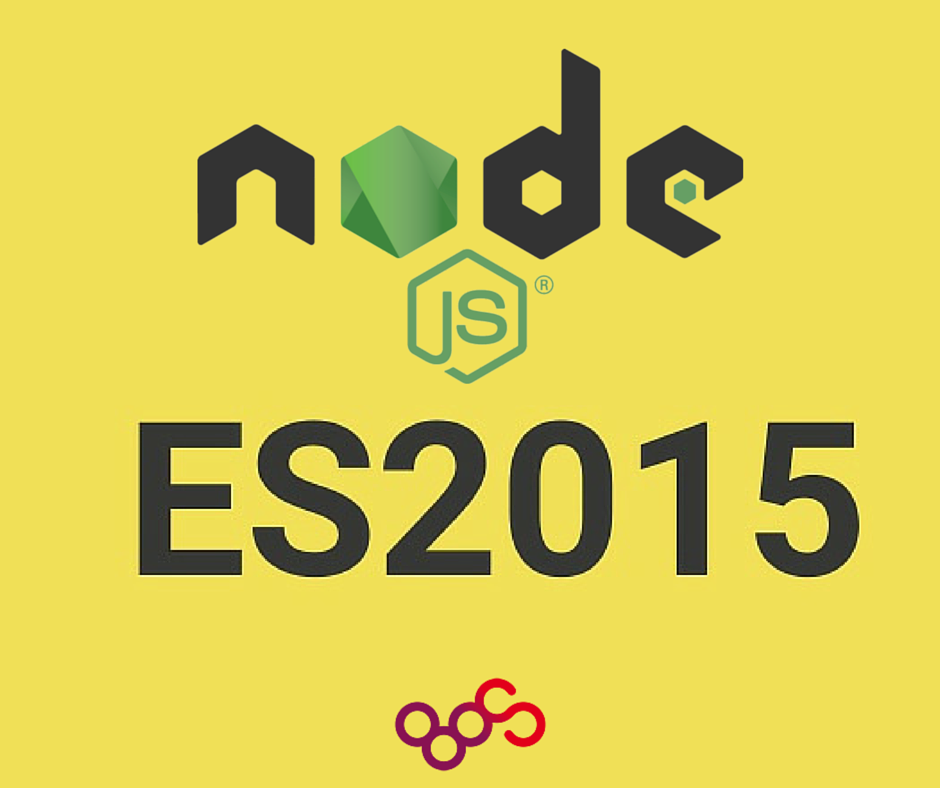

# Variables
## const
## let
## rendimiento
[Rendimiento ES6](http://www.todojs.com/rendimiento-de-es6-en-node-4/)
# Template string
## Multi line
## Tagging

# Promesas

# Arrow function
## scope
## deteccion
[Como Detectar Arrow Function](http://www.todojs.com/diferenciar-arrow-function-de-function/)

# Objects
## Objects literals
## getter & setter

# Enlaces de interes y fuentes de los ejemplos.
- [node.grenn](http://node.green/)
- [kangax](https://kangax.github.io/compat-table/es6/)
- [scotch.io](https://scotch.io/tutorials/better-node-with-es6-pt-i)
- [funcion13.com ES2015](https://www.funcion13.com/tag/es6/) *no todo esta soportado en node4 